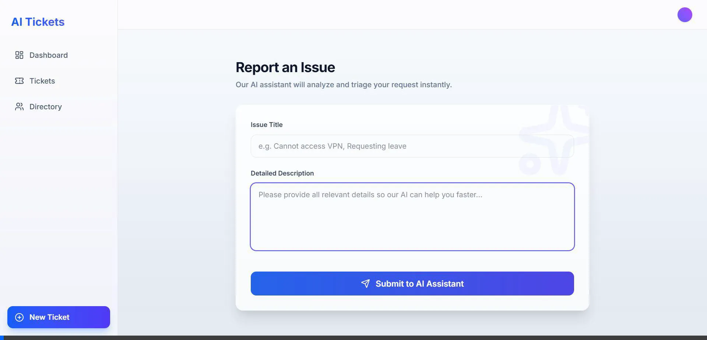

# Advanced AI Ticketing System

An intelligent, full-stack internal ticketing platform where AI analyzes incoming tickets, resolves common issues automatically, and intelligently routes remaining issues based on employee skills, availability, and load.

## Project Overview

This ticketing system acts as a smart "Level 1" helpdesk. Upon submission, an AI model (Google Gemini) analyzes the unstructured ticket description and categorizes it, assesses the severity and sentiment, and attempts to resolve it automatically if it matches common patterns (e.g., password resets). If human intervention is needed, the backend assigns the ticket to the most appropriate employee in the right department by matching skills and prioritizing those with lower workloads and active availability.

## Tech Stack

- **Frontend:** Next.js (App Router), React, TailwindCSS, Lucide React (Icons)
- **Backend/API:** Next.js Server Actions, Google Gemini 2.5 Flash (`@google/genai`)
- **Database:** SQLite with Prisma ORM

## Features

- **Module 1 (AI Analysis):** Instantly classifies category, severity, sentiment, and resolution path.
- **Module 2 (Auto-resolution):** Detects easily solvable issues (common FAQs) and writes an immediate helpful response.
- **Module 3 (Intelligent Routing):** Decides the destination department automatically based on ticket context.
- **Module 4 (Assignee Suggestions):** Assesses the load, availability (Available/Busy), and skills of employees to find the best match.
- **Module 5 (Ticket Lifecycle):** List views and search functionalities that operate with real-time Next.js data-polling.
- **Module 6 (Analytics Dashboard):** At-a-glance metrics focusing on auto-resolve success rates, load, and critical escalations.
- **UI/UX Polish:** Uses custom fluid animations and glassmorphism elements to provide a beautiful, seamless experience.

## Setup Instructions

1. **Clone the repository.**
2. **Install dependencies:**
   \`\`\`bash
   npm install
   \`\`\`
3. **Configure Environment Variables:**
   Create a \`.env\` file in the root directory:
   \`\`\`env
   DATABASE_URL="file:./dev.db"
   GEMINI_API_KEY="your_google_gemini_api_key_here"
   \`\`\`
4. **Initialize Database:**
   \`\`\`bash
   npx prisma db push
   npx prisma generate
   \`\`\`
5. **Seed the database (vital for the employee directory and routing logic):**
   \`\`\`bash
   node seed.mjs
   \`\`\`
6. **Start the development server:**
   \`\`\`bash
   npm run dev
   \`\`\`
   Navigate to [http://localhost:3000](http://localhost:3000)

## Known Limitations & Improvements

- **No Authentication:** Currently, anyone can submit or view tickets. Given more time, adding `NextAuth.js` or `Clerk` to establish roles (User, Agent, Admin) would be crucial.
- **Limited Interaction:** The system handles ticket creation and auto-assignment perfectly, but employee chat features or internal note adding inside a "detailed ticket view" are mockups/rudimentary. I would build a full detail page with a rich text editor.
- **Scalability of AI load:** The `generateContent` blocking call might slow down ticket ingestion if there's high volume. A message queue (like RabbitMQ or Redis BullMQ) could make processing asynchronous.

## Screenshots

*A demonstration of the full-stack ticketing platform and AI triage.*
